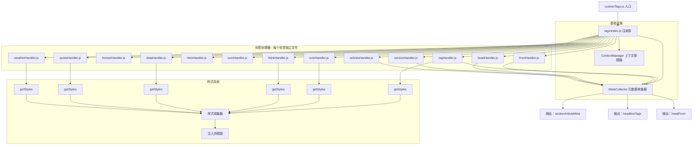
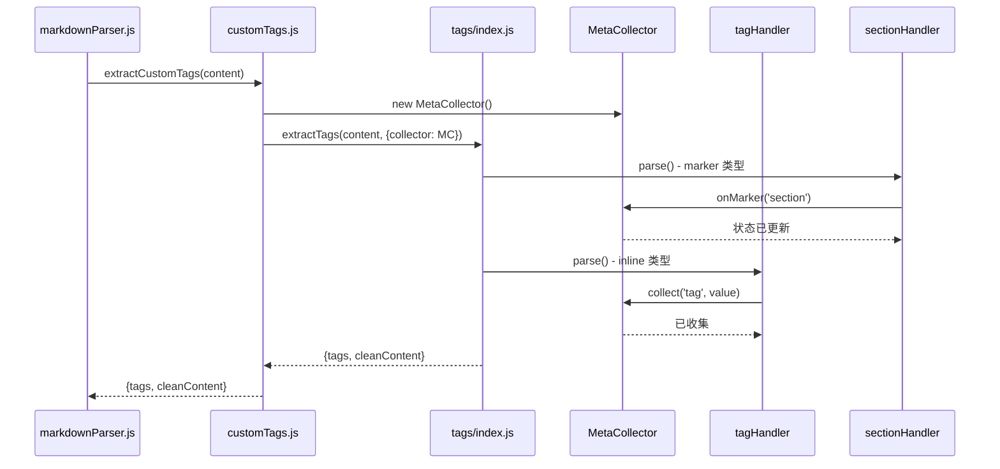

# 自定义标签系统完全模块化重构方案

## 1. 重构目标

将 [`src/parser/customTags.js`](src/parser/customTags.js)（约 350 行）重构为完全模块化的架构，**每个标签都有独立的处理器文件**，并支持标签自带样式。

## 2. 当前问题分析

| 问题 | 描述 | 影响 |
|------|------|------|
| **逻辑混杂** | 所有标签的解析逻辑挤在一个文件 | 难以定位和维护 |
| **重复代码** | 同一标签的正则匹配在不同位置重复 | 修改时易遗漏 |
| **扩展困难** | 新增标签需修改多处代码 | 开发体验差 |
| **职责不清** | 状态跟踪、数据提取、清理逻辑混合 | 难以测试 |
| **样式分散** | 样式集中在 index.ejs，与标签定义分离 | 维护困难 |

## 3. 新架构设计

### 3.1 目录结构

```
src/parser/
├── customTags.js                 # 主入口（约 20 行，仅组装）
└── tags/
    ├── index.js                  # 标签注册表（自动发现）
    ├── BaseHandler.js            # 处理器基类
    ├── MetaCollector.js          # 元数据收集器（全局状态）
    ├── ContextManager.js         # 上下文管理器（作用域判断）
    └── tags/                     # 每个标签独立模块
        ├── tagHandler.js         # [tag:xxx] 标签
        ├── fromHandler.js        # [from:xxx] 标签
        ├── fromstrHandler.js     # [fromstr:xxx] 标签
        ├── iconHandler.js        # [icon:xxx] 标签
        ├── introHandler.js       # [intro:xxx] 标签
        ├── sumHandler.js         # [sum:xxx] 标签
        ├── thinkHandler.js       # [think:xxx] 标签
        ├── headHandler.js        # [head]: 标记
        ├── sectionHandler.js     # [section]: 标记
        ├── articlesHandler.js    # [articles]: 标记
        ├── dataHandler.js        # <data>...</data> 区块
        ├── quoteHandler.js       # 引用块 >
        └── weatherHandler.js     # <weather>...</weather> 区块
```

### 3.2 架构图



### 3.3 数据流



## 4. 核心模块设计

### 4.1 处理器基类 [`tags/BaseHandler.js`](src/parser/tags/BaseHandler.js)

```javascript
/**
 * 标签处理器基类
 * 所有标签处理器的父类
 */

class BaseHandler {
  constructor() {
    this.name = this.constructor.name.replace('Handler', '').toLowerCase();
  }

  getName() {
    return this.name;
  }

  /**
   * 解析标签 - 子类必须实现
   * @param {string} content - 内容
   * @param {Object} context - 上下文
   * @returns {Object|null} 解析结果
   */
  parse(content, context) {
    throw new Error('parse() must be implemented by subclass');
  }

  /**
   * 清理标签 - 子类可选实现
   * @param {string} content - 内容
   * @returns {string} 清理后的内容
   */
  clean(content) {
    return content;
  }

  /**
   * 获取标签类型
   * @returns {'inline'|'marker'|'block'}
   */
  getType() {
    return 'inline';
  }

  /**
   * 获取标签所需的 CSS 样式
   * 子类可重写此方法返回自定义样式
   * @returns {string} CSS 样式字符串
   */
  getStyles() {
    return '';
  }
}

module.exports = BaseHandler;
```

### 4.2 元数据收集器 [`tags/MetaCollector.js`](src/parser/tags/MetaCollector.js)

核心职责：
- 跟踪文档状态（`inHeadline`/`inSection`/`inArticles`）
- 收集 section/article 级别的元数据
- 构建 `sectionArticleMeta` 输出

主要方法：
- `onMarker(markerName)` - 处理标记标签触发状态变化
- `collect(name, value)` - 收集行内标签元数据
- `getResult()` - 获取最终结果

### 4.3 标签注册表 [`tags/index.js`](src/parser/tags/index.js)

核心职责：
- 自动发现 `tags/` 目录下所有 `*Handler.js` 文件
- 实例化并注册所有处理器
- 提供统一的 `extractTags()` 入口
- 收集所有标签的样式

```javascript
/**
 * 标签注册表
 * 自动发现并注册所有标签处理器
 */

const fs = require('fs');
const path = require('path');
const MetaCollector = require('./MetaCollector');

class TagRegistry {
  constructor() {
    this.handlers = [];
    this.styleCache = null;
    this.initialize();
  }

  /**
   * 自动发现并注册所有标签处理器
   */
  initialize() {
    const tagsDir = path.join(__dirname, 'tags');
    const files = fs.readdirSync(tagsDir);

    for (const file of files) {
      if (file.endsWith('Handler.js')) {
        const HandlerClass = require(path.join(tagsDir, file));
        const handler = new HandlerClass();
        this.handlers.push(handler);
      }
    }
  }

  /**
   * 获取所有处理器
   */
  getAllHandlers() {
    return this.handlers;
  }

  /**
   * 提取标签（主入口）
   */
  extractTags(content, options = {}) {
    const collector = options.collector || new MetaCollector();
    const context = { collector };

    // 按类型分组处理
    const inlineHandlers = this.handlers.filter(h => h.getType() === 'inline');
    const markerHandlers = this.handlers.filter(h => h.getType() === 'marker');
    const blockHandlers = this.handlers.filter(h => h.getType() === 'block');

    // 先处理 marker（建立状态）
    for (const handler of markerHandlers) {
      handler.parse(content, context);
    }

    // 处理 inline 标签
    for (const handler of inlineHandlers) {
      handler.parse(content, context);
    }

    // 处理 block 标签
    for (const handler of blockHandlers) {
      handler.parse(content, context);
    }

    // 清理内容（只清理 inline 和 marker）
    let cleanContent = content;
    for (const handler of [...inlineHandlers, ...markerHandlers]) {
      cleanContent = handler.clean(cleanContent);
    }

    // 获取元数据
    const meta = collector.getResult();

    // 构建返回结果
    const tags = this._buildTagsResult(meta);

    return { tags, cleanContent };
  }

  /**
   * 收集所有标签的样式
   * @returns {string} 所有样式的组合
   */
  collectStyles() {
    // 使用缓存避免重复计算
    if (this.styleCache) return this.styleCache;
    
    const styles = [];
    const seen = new Set();
    
    for (const handler of this.handlers) {
      if (typeof handler.getStyles === 'function') {
        const style = handler.getStyles();
        if (style && style.trim() && !seen.has(handler.name)) {
          styles.push(style.trim());
          seen.add(handler.name);
        }
      }
    }
    
    this.styleCache = styles.join('\n');
    return this.styleCache;
  }

  /**
   * 获取样式 HTML 标签
   * @returns {string} <style> 标签
   */
  getStylesHTML() {
    const styles = this.collectStyles();
    if (!styles) return '';
    return `<style>${styles}</style>`;
  }

  /**
   * 清除样式缓存（开发模式使用）
   */
  clearStyleCache() {
    this.styleCache = null;
  }

  _buildTagsResult(meta) {
    return {
      sectionArticleMeta: meta.sectionArticleMeta,
      headlineTags: meta.headlineTags,
      headFrom: meta.headFrom,
    };
  }
}

module.exports = new TagRegistry();
```

### 4.4 标签处理器示例

#### 行内标签：[`tags/tags/tagHandler.js`](src/parser/tags/tags/tagHandler.js)

```javascript
const BaseHandler = require('../BaseHandler');

class TagHandler extends BaseHandler {
  constructor() {
    super();
    this.syntax = /^\[tag:([^\]]+)\]:\s*#\s*$/m;
  }

  getType() {
    return 'inline';
  }

  parse(content, context) {
    const results = [];
    const lines = content.split('\n');

    for (let i = 0; i < lines.length; i++) {
      const line = lines[i];
      const match = line.match(this.syntax);

      if (match) {
        results.push({
          name: this.name,
          value: match[1],
          lineIndex: i,
        });

        if (context?.collector) {
          context.collector.collect('tag', match[1]);
        }
      }
    }

    return results;
  }

  clean(content) {
    return content.replace(this.syntax, '');
  }

  getStyles() {
    return `
      .front-tag{font-size:.72rem;padding:4px 12px;background:#f0ede8;border-radius:20px;color:var(--text-muted)}
      .article-tag{display:inline-block;background:#e8e6e1;padding:2px 10px;border-radius:4px;margin-right:8px;font-size:.72rem}
    `;
  }
}

module.exports = TagHandler;
```

#### 标记标签：[`tags/tags/sectionHandler.js`](src/parser/tags/tags/sectionHandler.js)

```javascript
const BaseHandler = require('../BaseHandler');

class SectionHandler extends BaseHandler {
  constructor() {
    super();
    this.syntax = /^\[section\]:\s*#\s*$/m;
  }

  getType() {
    return 'marker';
  }

  parse(content, context) {
    const results = [];
    const lines = content.split('\n');

    for (let i = 0; i < lines.length; i++) {
      const line = lines[i];
      const match = line.match(this.syntax);

      if (match) {
        results.push({
          name: this.name,
          match: match[0],
          lineIndex: i,
        });

        if (context?.collector) {
          context.collector.onMarker('section');
        }
      }
    }

    return results;
  }

  clean(content) {
    return content.replace(this.syntax, '');
  }
}

module.exports = SectionHandler;
```

#### 区块标签：[`tags/tags/dataHandler.js`](src/parser/tags/tags/dataHandler.js)

```javascript
const BaseHandler = require('../BaseHandler');

class DataHandler extends BaseHandler {
  constructor() {
    super();
    this.syntax = /<data>([\s\S]*?)<\/data>/g;
  }

  getType() {
    return 'block';
  }

  parse(content, context) {
    const results = [];
    let match;
    this.syntax.lastIndex = 0;

    while ((match = this.syntax.exec(content)) !== null) {
      const parsedData = this._parseDataBlock(match[1]);
      if (parsedData) {
        results.push({
          name: this.name,
          data: parsedData,
          match: match[0],
          index: match.index,
        });
      }
    }

    return results;
  }

  clean(content) {
    return content; // 保留在内容中
  }

  getStyles() {
    return `
      .front-stats{display:flex;gap:20px;flex-wrap:wrap;margin:16px 0;padding:20px;background:linear-gradient(135deg,#f8f9fa,#fff);border-radius:12px}
      .front-stat{flex:1;min-width:120px;text-align:center;padding:12px}
      .front-stat-value{font-size:1.6rem;font-weight:700;color:var(--accent-blue)}
      .front-stat-label{font-size:.78rem;color:var(--text-muted);margin-top:4px}
    `;
  }

  _parseDataBlock(dataContent) {
    const items = [];
    const regex = /<num>([^<]+)<\/num>\s*<str>([^<]+)<\/str>/g;
    let numMatch;
    while ((numMatch = regex.exec(dataContent)) !== null) {
      items.push({ value: numMatch[1], label: numMatch[2] });
    }
    return items.length > 0 ? items : null;
  }
}

module.exports = DataHandler;
```

#### 天气标签：[`tags/tags/weatherHandler.js`](src/parser/tags/tags/weatherHandler.js)

```javascript
const BaseHandler = require('../BaseHandler');

class WeatherHandler extends BaseHandler {
  constructor() {
    super();
    this.syntax = /<weather(?:\s+center)?>([\s\S]*?)<\/weather>/g;
  }

  getType() {
    return 'block';
  }

  parse(content, context) {
    const results = [];
    let match;
    this.syntax.lastIndex = 0;

    while ((match = this.syntax.exec(content)) !== null) {
      const parsedData = this._parseWeatherData(match[0], match[1]);
      if (parsedData) {
        results.push({
          name: this.name,
          data: parsedData,
          match: match[0],
          index: match.index,
        });
      }
    }

    return results;
  }

  clean(content) {
    return content; // 保留在内容中
  }

  getStyles() {
    return `
      .weather-grid{display:flex;gap:12px;flex-wrap:nowrap;overflow-x:auto;padding:16px;background:linear-gradient(135deg,#e3f2fd,#bbdefb);border-radius:12px;margin:16px 0;-webkit-overflow-scrolling:touch}
      .weather-grid::-webkit-scrollbar{height:6px}
      .weather-grid::-webkit-scrollbar-track{background:transparent}
      .weather-grid::-webkit-scrollbar-thumb{background:#90caf9;border-radius:3px}
      .weather-grid.weather-center{justify-content:flex-start}
      .weather-item{flex:0 0 auto;min-width:110px;max-width:130px;background:#fff;border-radius:12px;padding:14px 12px;text-align:center;box-shadow:0 2px 8px rgba(0,0,0,.1);transition:transform .2s ease}
      .weather-item:hover{transform:translateY(-2px);box-shadow:0 4px 12px rgba(0,0,0,.15)}
      .weather-icon{font-size:2rem;margin-bottom:4px}
      .weather-city{font-weight:600;color:#1565c0;font-size:.9rem}
      .weather-city-placeholder{visibility:hidden}
      .weather-condition{color:#757575;font-size:.85rem}
      .weather-temp{color:#424242;font-size:.85rem;margin-top:4px}
      .weather-day{font-size:.75rem;color:#9e9e9e;margin-top:8px;padding-top:8px;border-top:1px dashed #e0e0e0}
    `;
  }

  _parseWeatherData(fullMatch, content) {
    const dayRegex = /<day>([^<]+)<\/day>/g;
    const items = [];
    const center = fullMatch.includes('center');
    let m;

    while ((m = dayRegex.exec(content)) !== null) {
      const parts = m[1].split('|');
      if (parts.length >= 4) {
        let day, city, icon, condition, temp;
        if (parts.length === 4) {
          day = parts[0].trim();
          city = null;
          icon = parts[1].trim();
          condition = parts[2].trim();
          temp = parts[3].trim();
        } else {
          day = parts[0].trim();
          city = parts[1].trim();
          icon = parts[2].trim();
          condition = parts[3].trim();
          temp = parts[4].trim();
        }
        items.push({ day, city, icon, condition, temp });
      }
    }

    return items.length > 0 ? { items, center } : null;
  }
}

module.exports = WeatherHandler;
```

#### 思考标签：[`tags/tags/thinkHandler.js`](src/parser/tags/tags/thinkHandler.js)

```javascript
const BaseHandler = require('../BaseHandler');

class ThinkHandler extends BaseHandler {
  constructor() {
    super();
    this.syntax = /^\[think:([^\]]+)\]:\s*#\s*$/m;
  }

  getType() {
    return 'inline';
  }

  parse(content, context) {
    const results = [];
    const lines = content.split('\n');

    for (let i = 0; i < lines.length; i++) {
      const line = lines[i];
      const match = line.match(this.syntax);

      if (match) {
        results.push({
          name: this.name,
          value: match[1],
          lineIndex: i,
        });

        if (context?.collector) {
          context.collector.collect('think', match[1]);
        }
      }
    }

    return results;
  }

  clean(content) {
    return content.replace(this.syntax, '');
  }

  getStyles() {
    return `
      .thought-box{margin-top:18px;padding:16px;background:linear-gradient(135deg,#fef9e7,#fffcf5);border:1px solid #f0e6c8;border-radius:8px}
      .thought-title{font-size:.8rem;font-weight:600;color:var(--accent-gold);margin-bottom:8px;display:flex;align-items:center;gap:5px}
      .thought-content{font-size:.88rem;color:var(--text-dark);font-style:italic;line-height:1.6}
    `;
  }
}

module.exports = ThinkHandler;
```

### 4.5 简化后的 [`customTags.js`](src/parser/customTags.js)

```javascript
/**
 * 自定义标签提取模块
 * 使用新的 tags/index.js 架构作为核心解析引擎
 */

const tagRegistry = require('./tags');

function extractCustomTags(content) {
  return tagRegistry.extractTags(content);
}

module.exports = {
  extractCustomTags
};
```

## 5. 标签清单

| 文件 | 语法 | 类型 | 说明 |
|------|------|------|------|
| `tagHandler.js` | `[tag:xxx]: #` | inline | 标签 |
| `fromHandler.js` | `[from:xxx]: #` | inline | 来源 URL |
| `fromstrHandler.js` | `[fromstr:xxx]: #` | inline | 来源名称 |
| `iconHandler.js` | `[icon:xxx]: #` | inline | 章节图标 |
| `introHandler.js` | `[intro:xxx]: #` | inline | 章节简介 |
| `sumHandler.js` | `[sum:xxx]: #` | inline | 摘要 |
| `thinkHandler.js` | `[think:xxx]: #` | inline | 观点 |
| `headHandler.js` | `[head]: #` | marker | 头版头条标记 |
| `sectionHandler.js` | `[section]: #` | marker | 章节标记 |
| `articlesHandler.js` | `[articles]: #` | marker | 文章列表标记 |
| `dataHandler.js` | `<data>...</data>` | block | 数据块 |
| `quoteHandler.js` | `> 内容` | block | 引用块 |
| `weatherHandler.js` | `<weather>...</weather>` | block | 天气数据 |

## 6. 样式模块化设计

### 6.1 设计理念

采用 **标签处理器自带样式** 的方案，每个标签处理器可以返回自己的 CSS 样式，实现高内聚。

### 6.2 基类扩展

在 [`BaseHandler.js`](src/parser/tags/BaseHandler.js) 中添加 `getStyles()` 方法：

```javascript
class BaseHandler {
  // ...

  /**
   * 获取标签所需的 CSS 样式
   * 子类可重写此方法返回自定义样式
   * @returns {string} CSS 样式字符串
   */
  getStyles() {
    return '';
  }
}
```

### 6.3 标签样式示例

#### 数据块标签样式 [`tags/tags/dataHandler.js`](src/parser/tags/tags/dataHandler.js)

```javascript
getStyles() {
  return `
    .front-stats{display:flex;gap:20px;flex-wrap:wrap;margin:16px 0;padding:20px;background:linear-gradient(135deg,#f8f9fa,#fff);border-radius:12px}
    .front-stat{flex:1;min-width:120px;text-align:center;padding:12px}
    .front-stat-value{font-size:1.6rem;font-weight:700;color:var(--accent-blue)}
    .front-stat-label{font-size:.78rem;color:var(--text-muted);margin-top:4px}
  `;
}
```

#### 天气标签样式 [`tags/tags/weatherHandler.js`](src/parser/tags/tags/weatherHandler.js)

```javascript
getStyles() {
  return `
    .weather-grid{display:flex;gap:12px;flex-wrap:nowrap;overflow-x:auto;padding:16px;background:linear-gradient(135deg,#e3f2fd,#bbdefb);border-radius:12px;margin:16px 0}
    .weather-item{flex:0 0 auto;min-width:110px;max-width:130px;background:#fff;border-radius:12px;padding:14px 12px;text-align:center;box-shadow:0 2px 8px rgba(0,0,0,.1)}
    .weather-icon{font-size:2rem;margin-bottom:4px}
    .weather-city{font-weight:600;color:#1565c0;font-size:.9rem}
    .weather-condition{color:#757575;font-size:.85rem}
    .weather-temp{color:#424242;font-size:.85rem;margin-top:4px}
    .weather-day{font-size:.75rem;color:#9e9e9e;margin-top:8px;padding-top:8px;border-top:1px dashed #e0e0e0}
  `;
}
```

#### 引用块标签样式 [`tags/tags/quoteHandler.js`](src/parser/tags/tags/quoteHandler.js)

```javascript
getStyles() {
  return `
    .front-detail{margin-top:28px;padding:20px;background:#f8f9fa;border-left:4px solid var(--accent-blue);border-radius:0 8px 8px 0}
    .front-detail blockquote{margin:0;padding:0 16px;border-left:3px solid #ddd;font-style:italic}
  `;
}
```

#### 思考标签样式 [`tags/tags/thinkHandler.js`](src/parser/tags/tags/thinkHandler.js)

```javascript
getStyles() {
  return `
    .thought-box{margin-top:18px;padding:16px;background:linear-gradient(135deg,#fef9e7,#fffcf5);border:1px solid #f0e6c8;border-radius:8px}
    .thought-title{font-size:.8rem;font-weight:600;color:var(--accent-gold);margin-bottom:8px;display:flex;align-items:center;gap:5px}
    .thought-content{font-size:.88rem;color:var(--text-dark);font-style:italic;line-height:1.6}
  `;
}
```

### 6.4 注册表收集样式

在 [`tags/index.js`](src/parser/tags/index.js) 中添加样式收集方法：

```javascript
class TagRegistry {
  // ...

  /**
   * 收集所有标签的样式
   * @returns {string} 所有样式的组合
   */
  collectStyles() {
    // 使用缓存避免重复计算
    if (this.styleCache) return this.styleCache;
    
    const styles = [];
    const seen = new Set();
    
    for (const handler of this.handlers) {
      if (typeof handler.getStyles === 'function') {
        const style = handler.getStyles();
        if (style && style.trim() && !seen.has(handler.name)) {
          styles.push(style.trim());
          seen.add(handler.name);
        }
      }
    }
    
    this.styleCache = styles.join('\n');
    return this.styleCache;
  }

  /**
   * 获取样式 HTML 标签
   * @returns {string} <style> 标签
   */
  getStylesHTML() {
    const styles = this.collectStyles();
    if (!styles) return '';
    return `<style>${styles}</style>`;
  }

  /**
   * 清除样式缓存（开发模式使用）
   */
  clearStyleCache() {
    this.styleCache = null;
  }
}
```

### 6.5 视图中使用

在 [`views/index.ejs`](views/index.ejs) 的 `<head>` 中注入：

```ejs
<head>
  <meta charset="UTF-8">
  <title><%= title %></title>
  
  <!-- 基础样式 -->
  <style>
    :root{--ink-black:#1a1a1a;--paper-bg:#f5f2eb;--accent-red:#c41e3a;--accent-blue:#1e3a5f;--accent-gold:#b8860b;--text-dark:#2c2c2c;--text-muted:#666;--border-color:#d4d0c8}
    /* 其他基础样式... */
  </style>
  
  <!-- 标签样式 - 自动注入 -->
  <%- tagRegistry.collectStyles() %>
</head>
```

### 6.6 样式变量继承

标签样式可以使用全局 CSS 变量：

```css
/* 全局变量在 index.ejs 中定义 */
:root {
  --ink-black: #1a1a1a;
  --paper-bg: #f5f2eb;
  --accent-red: #c41e3a;
  --accent-blue: #1e3a5f;
  --accent-gold: #b8860b;
  --text-dark: #2c2c2c;
  --text-muted: #666;
  --border-color: #d4d0c8;
}

/* 标签样式使用变量 */
.thought-box {
  background: linear-gradient(135deg, #fef9e7, #fffcf5);
  border: 1px solid #f0e6c8;
}
```

## 7. 实施步骤

### 步骤 1: 创建基础设施模块
- [ ] 创建 `tags/BaseHandler.js`
- [ ] 创建 `tags/MetaCollector.js`
- [ ] 创建 `tags/ContextManager.js`（可选）

### 步骤 2: 创建标签处理器
- [ ] 创建 `tags/tags/tagHandler.js`
- [ ] 创建 `tags/tags/fromHandler.js`
- [ ] 创建 `tags/tags/fromstrHandler.js`
- [ ] 创建 `tags/tags/iconHandler.js`
- [ ] 创建 `tags/tags/introHandler.js`
- [ ] 创建 `tags/tags/sumHandler.js`
- [ ] 创建 `tags/tags/thinkHandler.js`
- [ ] 创建 `tags/tags/headHandler.js`
- [ ] 创建 `tags/tags/sectionHandler.js`
- [ ] 创建 `tags/tags/articlesHandler.js`
- [ ] 创建 `tags/tags/dataHandler.js`
- [ ] 创建 `tags/tags/quoteHandler.js`
- [ ] 创建 `tags/tags/weatherHandler.js`

### 步骤 3: 重构注册表
- [ ] 重写 `tags/index.js` 实现自动发现和样式收集

### 步骤 4: 简化入口
- [ ] 简化 `customTags.js` 为约 20 行

### 步骤 5: 更新视图
- [ ] 在 `views/index.ejs` 中添加标签样式注入
- [ ] 移除重复的 CSS 样式

### 步骤 6: 测试验证
- [ ] 运行现有测试确保兼容性
- [ ] 添加新标签处理器单元测试

## 8. 优势

| 优势 | 说明 |
|------|------|
| **高内聚** | 每个标签的所有逻辑（解析 + 样式）都在一个文件中 |
| **低耦合** | 标签之间无依赖，可独立修改 |
| **易扩展** | 新增标签只需添加一个文件 |
| **易测试** | 每个处理器可单独测试 |
| **易维护** | 问题定位快速，修改影响范围小 |
| **样式自治** | 标签自带样式，无需在视图中手动添加 |

## 9. 新增标签示例

假设要新增 `[author:张三]: #` 标签，只需：

1. 创建 `tags/tags/authorHandler.js`
2. 实现 `parse()` 和 `clean()` 方法
3. 可选实现 `getStyles()` 返回样式
4. 在 `MetaCollector` 中添加收集逻辑（如需要）

**无需修改任何其他文件！**

```javascript
// tags/tags/authorHandler.js
const BaseHandler = require('../BaseHandler');

class AuthorHandler extends BaseHandler {
  constructor() {
    super();
    this.syntax = /^\[author:([^\]]+)\]:\s*#\s*$/m;
  }

  getType() {
    return 'inline';
  }

  parse(content, context) {
    const results = [];
    let match;
    while ((match = this.syntax.exec(content)) !== null) {
      results.push({
        name: this.name,
        value: match[1],
        index: match.index,
      });
      if (context?.collector) {
        context.collector.collect('author', match[1]);
      }
    }
    return results;
  }

  clean(content) {
    return content.replace(this.syntax, '');
  }

  getStyles() {
    return `
      .article-author{font-size:.8rem;color:var(--text-muted);margin-top:8px}
      .article-author::before{content:'作者：';color:var(--accent-blue)}
    `;
  }
}

module.exports = AuthorHandler;
```

## 10. 文件列表

重构后的完整文件列表：

```
src/parser/
├── customTags.js                 # 主入口（新 - 约 20 行）
└── tags/
    ├── index.js                  # 标签注册表（新 - 约 120 行）
    ├── BaseHandler.js            # 处理器基类（新 - 约 40 行）
    ├── MetaCollector.js          # 元数据收集器（新 - 约 120 行）
    └── tags/
        ├── tagHandler.js         # 新 - 约 40 行
        ├── fromHandler.js        # 新 - 约 35 行
        ├── fromstrHandler.js     # 新 - 约 35 行
        ├── iconHandler.js        # 新 - 约 40 行
        ├── introHandler.js       # 新 - 约 35 行
        ├── sumHandler.js         # 新 - 约 35 行
        ├── thinkHandler.js       # 新 - 约 40 行
        ├── headHandler.js        # 新 - 约 35 行
        ├── sectionHandler.js     # 新 - 约 35 行
        ├── articlesHandler.js    # 新 - 约 35 行
        ├── dataHandler.js        # 新 - 约 60 行
        ├── quoteHandler.js       # 新 - 约 50 行
        └── weatherHandler.js     # 新 - 约 80 行
```

**代码行数对比：**

| 项目 | 重构前 | 重构后 |
|------|--------|--------|
| `customTags.js` | ~350 行 | ~20 行 |
| 标签系统 | 0 行 | ~660 行 |
| **总计** | ~350 行 | ~680 行 |

虽然总行数增加了，但：
- 每个文件更小、更专注
- 每个标签独立，易于维护
- 新增标签无需修改现有代码
- 样式与标签定义在一起，高内聚
