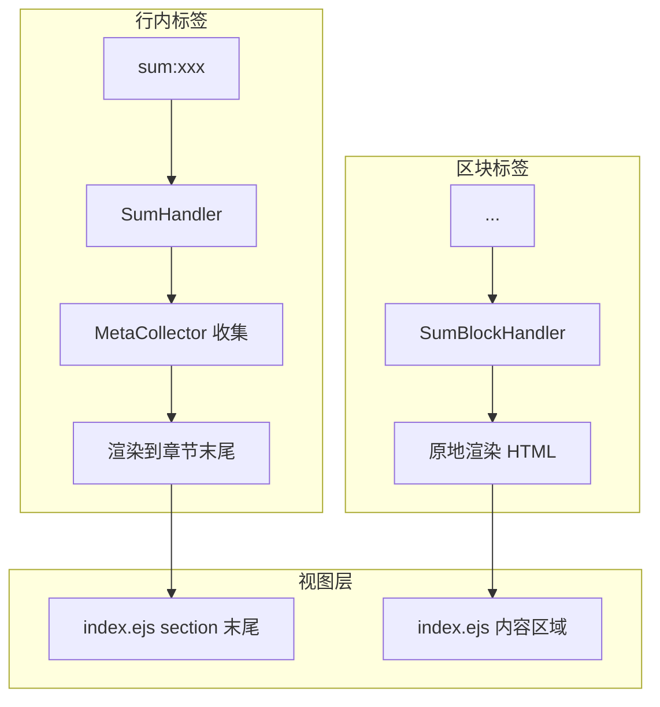

# 章节 sum 和 think 标签重构方案

## 概述

本方案对现有的 sum 和 think 标签进行重构，区分两种使用场景：

| 标签类型 | 语法 | 作用域 | 渲染位置 |
|----------|------|--------|----------|
| **行内标签（原有）** | `[sum:xxx]: #` / `[think:xxx]: #` | 章节级别 | 章节末尾 |
| **区块标签（新增）** | `<sum>...</sum>` / `<think>...</think>` | 任意位置 | 原地渲染 |

## 当前状态分析

### 现有实现

| 组件 | 状态 | 说明 |
|------|------|------|
| [`SumHandler.js`](src/parser/tags/handlers/inline/SumHandler.js:1) | 行内标签 | 解析 `[sum:xxx]: #`，原地渲染 HTML |
| [`ThinkHandler.js`](src/parser/tags/handlers/inline/ThinkHandler.js:1) | 行内标签 | 解析 `[think:xxx]: #`，原地渲染 HTML |
| [`MetaCollector.js`](src/parser/tags/MetaCollector.js:214) | 已支持 | 收集各层级的 sum/thinks |

### 问题

- 现有行内标签在任意位置都会原地渲染
- 用户希望章节级别的 `[sum:xxx]: #` 和 `[think:xxx]: #` 渲染到章节末尾
- 需要新增区块标签 `<sum>` 和 `<think>` 用于原地渲染

## 重构方案

### 架构设计



### 步骤 1：创建新的 Block 类型处理器

#### 1.1 SumBlockHandler.js

**文件**: `src/parser/tags/handlers/block/SumBlockHandler.js`

```javascript
/**
 * <sum>...</sum> 标签处理器
 * 用于标记摘要，作为 block 类型处理器，原地渲染 HTML
 */

const BaseHandler = require('../../BaseHandler');

class SumBlockHandler extends BaseHandler {
  constructor() {
    super();
    // 匹配 <sum>...</sum> 区块
    this.syntax = /<sum>([\s\S]*?)<\/sum>/g;
  }

  getType() {
    return 'block';
  }

  parseDocument(content, context) {
    const results = [];
    const matches = [...content.matchAll(this.syntax)];
    
    for (const match of matches) {
      const value = match[1].trim();
      results.push({
        name: this.name,
        value: value,
        html: this._renderHTML(value)
      });
    }
    
    return results;
  }

  _renderHTML(value) {
    return `<div class="analysis-box"><div class="analysis-title">总结</div><div class="analysis-content">${value}</div></div>`;
  }

  clean(content) {
    return content.replace(this.syntax, '');
  }

  getStyles() {
    return `
.analysis-box{margin-top:28px;padding:20px;background:#f8f9fa;border-left:4px solid var(--accent-blue);border-radius:0 8px 8px 0}
.analysis-title{font-size:.85rem;font-weight:600;color:var(--accent-blue);margin-bottom:10px;display:flex;align-items:center;gap:6px}
.analysis-title::before{content:'■';color:var(--accent-blue);font-size:.6rem}
.analysis-content{font-size:.92rem;color:var(--text-dark);line-height:1.65}
    `.trim();
  }
}

module.exports = SumBlockHandler;
```

#### 1.2 ThinkBlockHandler.js

**文件**: `src/parser/tags/handlers/block/ThinkBlockHandler.js`

```javascript
/**
 * <think>...</think> 标签处理器
 * 用于标记观点，作为 block 类型处理器，原地渲染 HTML
 */

const BaseHandler = require('../../BaseHandler');

class ThinkBlockHandler extends BaseHandler {
  constructor() {
    super();
    // 匹配 <think>...</think> 区块
    this.syntax = /<think>([\s\S]*?)<\/think>/g;
  }

  getType() {
    return 'block';
  }

  parseDocument(content, context) {
    const results = [];
    const matches = [...content.matchAll(this.syntax)];
    
    for (const match of matches) {
      const value = match[1].trim();
      results.push({
        name: this.name,
        value: value,
        html: this._renderHTML(value)
      });
    }
    
    return results;
  }

  _renderHTML(value) {
    return `<div class="thought-box"><div class="thought-title">思考</div><div class="thought-content">${value}</div></div>`;
  }

  clean(content) {
    return content.replace(this.syntax, '');
  }

  getStyles() {
    return `
.thought-box{margin-top:18px;padding:16px;background:linear-gradient(135deg,#fef9e7,#fffcf5);border:1px solid #f0e6c8;border-radius:8px}
.thought-title{font-size:.8rem;font-weight:600;color:var(--accent-gold);margin-bottom:8px;display:flex;align-items:center;gap:5px}
.thought-title::before{content:'💡';font-size:.7rem}
.thought-content{font-size:.88rem;color:var(--text-dark);font-style:italic;line-height:1.6}
    `.trim();
  }
}

module.exports = ThinkBlockHandler;
```

### 步骤 2：修改现有行内处理器

#### 2.1 修改 SumHandler.js

**文件**: [`src/parser/tags/handlers/inline/SumHandler.js`](src/parser/tags/handlers/inline/SumHandler.js:1)

**变更**:
- 移除原地渲染 HTML 的逻辑
- 只收集元数据，不返回 html 字段
- 保持 clean 方法移除标签

```javascript
/**
 * [sum:xxx] 标签处理器
 * 用于标记摘要
 * 作为行内标签，只收集元数据，渲染到章节末尾
 */

const BaseHandler = require('../../BaseHandler');

class SumHandler extends BaseHandler {
  constructor() {
    super();
    this.syntax = /^\[sum:([^\]]+)\]:\s*#\s*$/;
  }

  getType() {
    return 'inline';
  }

  parseLine(line, context, lineIndex) {
    const match = line.match(this.syntax);
    if (!match) {
      return null;
    }

    const value = match[1];
    
    // 只收集元数据，不返回 HTML
    if (context?.collector) {
      context.collector.collect('sum', value, context.state);
    }

    return {
      name: this.name,
      value: value,
      lineIndex
      // 移除 html 字段
    };
  }

  clean(content) {
    return content.replace(new RegExp(this.syntax.source, 'gm'), '');
  }

  getStyles() {
    // 样式保留，因为视图层仍需要使用
    return `
.analysis-box{margin-top:28px;padding:20px;background:#f8f9fa;border-left:4px solid var(--accent-blue);border-radius:0 8px 8px 0}
.analysis-title{font-size:.85rem;font-weight:600;color:var(--accent-blue);margin-bottom:10px;display:flex;align-items:center;gap:6px}
.analysis-title::before{content:'■';color:var(--accent-blue);font-size:.6rem}
.analysis-content{font-size:.92rem;color:var(--text-dark);line-height:1.65}
    `.trim();
  }
}

module.exports = SumHandler;
```

#### 2.2 修改 ThinkHandler.js

**文件**: [`src/parser/tags/handlers/inline/ThinkHandler.js`](src/parser/tags/handlers/inline/ThinkHandler.js:1)

**变更**: 同上，移除原地渲染逻辑

```javascript
/**
 * [think:xxx] 标签处理器
 * 用于标记观点
 * 作为行内标签，只收集元数据，渲染到章节末尾
 */

const BaseHandler = require('../../BaseHandler');

class ThinkHandler extends BaseHandler {
  constructor() {
    super();
    this.syntax = /^\[think:([^\]]+)\]:\s*#\s*$/;
  }

  getType() {
    return 'inline';
  }

  parseLine(line, context, lineIndex) {
    const match = line.match(this.syntax);
    if (!match) {
      return null;
    }

    const value = match[1];
    
    // 只收集元数据，不返回 HTML
    if (context?.collector) {
      context.collector.collect('think', value, context.state);
    }

    return {
      name: this.name,
      value: value,
      lineIndex
      // 移除 html 字段
    };
  }

  clean(content) {
    return content.replace(new RegExp(this.syntax.source, 'gm'), '');
  }

  getStyles() {
    return `
.thought-box{margin-top:18px;padding:16px;background:linear-gradient(135deg,#fef9e7,#fffcf5);border:1px solid #f0e6c8;border-radius:8px}
.thought-title{font-size:.8rem;font-weight:600;color:var(--accent-gold);margin-bottom:8px;display:flex;align-items:center;gap:5px}
.thought-title::before{content:'💡';font-size:.7rem}
.thought-content{font-size:.88rem;color:var(--text-dark);font-style:italic;line-height:1.6}
    `.trim();
  }
}

module.exports = ThinkHandler;
```

### 步骤 3：修改 tags/index.js 支持 block 标签的 HTML 渲染

**文件**: [`src/parser/tags/index.js`](src/parser/tags/index.js:1)

**变更**: 在 `extractTags()` 方法中，收集 block 标签的 HTML 用于原地渲染

```javascript
// 处理 block 标签（不需要逐行）
const blockHtmlReplacements = [];
for (const handler of blockHandlers) {
  if (typeof handler.parseDocument === 'function') {
    const results = handler.parseDocument(content, context);
    if (results && Array.isArray(results)) {
      for (const result of results) {
        if (result && result.html) {
          blockHtmlReplacements.push(result.html);
        }
      }
    }
  } else {
    handler.parse(content, context);
  }
}

// ...

// 构建 cleanContent，同时应用 HTML 替换
const cleanLines = [];
let blockHtmlIndex = 0;
for (let i = 0; i < lines.length; i++) {
  if (htmlReplacements.has(i)) {
    // 使用 inline handler 的 HTML 替换
    cleanLines.push(htmlReplacements.get(i));
  } else {
    // 正常清理
    let line = lines[i];
    for (const handler of [...inlineHandlers, ...markerHandlers]) {
      line = handler.clean(line);
    }
    cleanLines.push(line);
  }
}
const cleanContent = cleanLines.join('\n');

// block 标签的 HTML 需要特殊处理 - 在 markdownParser 中注入
// 这里将 block HTML 存储在 customTags 中
const blockHtmlContent = blockHtmlReplacements.join('\n');
```

### 步骤 4：修改 index.ejs 视图

**文件**: [`views/index.ejs`](views/index.ejs:219)

#### 4.1 章节级别的 sum/think 渲染到末尾

```ejs
<div class="section" id="section-<%= index %>">
  <div class="section-header">
    <span class="section-icon"><%= sectionIcon %></span>
    <h3 class="section-title"><%= section.title %></h3>
    <span class="section-number">P<%= String(index + 1).padStart(2, '0') %></span>
  </div>
  
  <% if (section.articles && section.articles.length > 0) { %>
    <% section.articles.forEach(article => { %>
      <!-- 文章内容 -->
    <% }); %>
  <% } %>
  
  <!-- 新增：章节总结（渲染到末尾） -->
  <% if (section.summary) { %>
  <div class="analysis-box">
    <div class="analysis-title">总结</div>
    <div class="analysis-content"><%= section.summary %></div>
  </div>
  <% } %>
  
  <!-- 新增：章节思考（渲染到末尾） -->
  <% if (section.think) { %>
  <div class="thought-box">
    <div class="thought-title">思考</div>
    <div class="thought-content"><%= section.think %></div>
  </div>
  <% } %>
</div>
```

#### 4.2 Block 标签的原地渲染

需要在 [`markdownParser.js`](src/markdownParser.js:1) 中处理 block 标签的 HTML 注入。

### 步骤 5：更新 MetaCollector（可选）

**文件**: [`src/parser/tags/MetaCollector.js`](src/parser/tags/MetaCollector.js:1)

当前实现已支持 section 级别的 sum/think 收集，无需修改。

### 步骤 6：更新文档

**文件**: [`docs/tags-dev-guide.md`](docs/tags-dev-guide.md:1)

新增章节说明两种标签的区别：

```markdown
## Sum 和 Think 标签

### 行内标签（章节级别）

**语法**: `[sum:xxx]: #` / `[think:xxx]: #`

**作用域**: 章节级别

**渲染位置**: 章节末尾

**示例**:
```markdown
[section]: #
# 章节标题
[sum:这是章节总结]: #
[think:这是章节思考]: #
[articles]: #
## 文章标题
文章内容...
<!-- 总结和思考会渲染在章节末尾 -->
```

### 区块标签（原地渲染）

**语法**: `<sum>...</sum>` / `<think>...</think>`

**作用域**: 任意位置

**渲染位置**: 标签所在位置

**示例**:
```markdown
## 文章标题
文章内容...

<sum>
这是文章的总结，可以跨多行。
支持复杂的格式。
</sum>

<think>
这是观点思考，同样支持多行。
</think>

更多文章内容...
```
```

### 步骤 7：添加测试用例

**文件**: `tests/tags/sumBlockHandler.test.js` (新增)

```javascript
const SumBlockHandler = require('../../src/parser/tags/handlers/block/SumBlockHandler');

describe('SumBlockHandler', () => {
  let handler;

  beforeEach(() => {
    handler = new SumBlockHandler();
  });

  test('should have correct name', () => {
    expect(handler.name).toBe('sumBlock');
  });

  test('should return block type', () => {
    expect(handler.getType()).toBe('block');
  });

  test('should parse sum block syntax', () => {
    const content = '<sum>This is a summary</sum>';
    const results = handler.parseDocument(content, {});
    expect(results).toHaveLength(1);
    expect(results[0].value).toBe('This is a summary');
    expect(results[0].html).toContain('analysis-box');
  });

  test('should handle multiline sum block', () => {
    const content = `<sum>
Line 1
Line 2
</sum>`;
    const results = handler.parseDocument(content, {});
    expect(results).toHaveLength(1);
    expect(results[0].value).toBe('Line 1\nLine 2');
  });

  test('should clean sum block syntax', () => {
    const content = 'Before<sum>summary</sum>After';
    const cleaned = handler.clean(content);
    expect(cleaned).toBe('BeforeAfter');
  });
});
```

**文件**: `tests/tags/thinkBlockHandler.test.js` (新增)

类似 SumBlockHandler 的测试。

## 渲染效果对比

### 行内标签（章节级别）

```markdown
[section]: #
# AI 热点
[sum:今日 AI 领域精彩纷呈]: #
[think:AI 发展进入新阶段]: #
[articles]: #
## 文章 1
内容...
```

**渲染效果**:
```
┌─────────────────────────────────────┐
│  🤖 AI 热点                P01      │
├─────────────────────────────────────┤
│  文章 1 标题                          │
│  文章内容...                        │
├─────────────────────────────────────┤
│  ┌─────────────────────────────┐    │
│  │ ■ 总结                       │    │
│  │   今日 AI 领域精彩纷呈        │    │
│  └─────────────────────────────┘    │
│  ┌─────────────────────────────┐    │
│  │ 💡 思考                      │    │
│  │   AI 发展进入新阶段           │    │
│  └─────────────────────────────┘    │
└─────────────────────────────────────┘
```

### 区块标签（原地渲染）

```markdown
## 文章标题
文章内容...

<sum>
这是文章的总结
</sum>

更多文章内容...
```

**渲染效果**:
```
文章标题
文章内容...

┌─────────────────────────────┐
│ ■ 总结                       │
│   这是文章的总结              │
└─────────────────────────────┘

更多文章内容...
```

## 文件变更清单

| 文件 | 操作 | 说明 |
|------|------|------|
| `src/parser/tags/handlers/block/SumBlockHandler.js` | 新建 | 新增 block 类型 sum 处理器 |
| `src/parser/tags/handlers/block/ThinkBlockHandler.js` | 新建 | 新增 block 类型 think 处理器 |
| [`src/parser/tags/handlers/inline/SumHandler.js`](src/parser/tags/handlers/inline/SumHandler.js:1) | 修改 | 移除原地渲染，只收集元数据 |
| [`src/parser/tags/handlers/inline/ThinkHandler.js`](src/parser/tags/handlers/inline/ThinkHandler.js:1) | 修改 | 移除原地渲染，只收集元数据 |
| [`src/parser/tags/index.js`](src/parser/tags/index.js:1) | 修改 | 支持 block 标签 HTML 收集 |
| [`views/index.ejs`](views/index.ejs:219) | 修改 | 章节末尾渲染 sum/think |
| [`docs/tags-dev-guide.md`](docs/tags-dev-guide.md:1) | 修改 | 更新文档说明 |
| `tests/tags/sumBlockHandler.test.js` | 新建 | 新增测试 |
| `tests/tags/thinkBlockHandler.test.js` | 新建 | 新增测试 |

## 时间线

| 步骤 | 预计时间 |
|------|----------|
| 创建 SumBlockHandler.js 和 ThinkBlockHandler.js | 15 分钟 |
| 修改 SumHandler.js 和 ThinkHandler.js | 10 分钟 |
| 修改 tags/index.js | 10 分钟 |
| 修改 index.ejs | 10 分钟 |
| 更新文档 | 10 分钟 |
| 添加测试 | 15 分钟 |
| **总计** | **70 分钟** |
